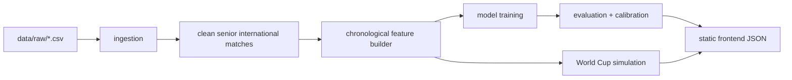

# International Football ML Pipeline

Production-oriented Python pipeline for international football match prediction from 2018 onward. It is designed to improve model quality through chronological feature engineering, dynamic Elo ratings, calibrated probabilities, strict time-series evaluation, and static JSON exports for a separate Next.js frontend.

The frontend is not part of this package. Static JSON files are the integration boundary.

## Architecture



## Data Flow

Place the historical international results CSV in:

```bash
ml-pipeline/data/raw/
```

Optional enrichment files can also be placed in `data/raw/`:

- `fifa_rankings.csv` with `date`, `team`, `rank`, and optional `points`
- `external_elo.csv` with `date`, `team`, `elo`
- `market_values.csv` with `date`, `team`, `market_value_eur`

Enrichment features are looked up chronologically using only records dated before the match.

Then run:

```bash
cd ml-pipeline
python -m src.cli run-all
```

For a dependency-light smoke test without Kaggle files:

```bash
cd ml-pipeline
python -m src.cli run-all --sample
```

The pipeline writes:

- `data/interim/matches_clean.csv`
- `data/processed/match_features.csv`
- `data/processed/team_strengths.csv`
- `data/processed/elo_history.csv`
- `models/*.joblib`
- `outputs/metrics/evaluation.json`
- `outputs/predictions/*.json`

## Feature Engineering

All features are emitted before the current match updates team state. This prevents future data leakage.

Implemented feature groups:

- Dynamic Elo: pre-match home/away Elo, Elo difference, rolling Elo delta, offensive Elo, defensive Elo.
- Rolling form: last 3/5/10 win rate, goals scored/conceded, goal difference, clean-sheet rate, expected points, exponentially weighted recent form, rest days.
- Attack/defense: attack strength, defensive strength, scoring/conceding rates, expected-goals proxy, expected-goals-against proxy.
- Tournament context: tournament importance, knockout flag, derby flag, host advantage, continental matchup, travel proxy, match pressure index.

## Elo Methodology

The Elo system is chronological and dynamic. Ratings start at 1500 and update after each match using:

- tournament-weighted K-factors
- home advantage unless neutral venue
- goal-difference multiplier
- cross-confederation balancing hook
- separate attack and defense Elo components

Tournament weights are configured in `src/constants.py`.

## Modeling

The default target is three-class classification:

- `H`: Home win
- `D`: Draw
- `A`: Away win

Configured models:

- Logistic Regression
- Random Forest
- XGBoost
- LightGBM
- CatBoost
- Elo + Poisson hybrid baseline

Optional libraries are handled defensively. If a model dependency is unavailable, that model is skipped and recorded in `models/training_manifest.json`.

## Validation And Calibration

The default chronological split is:

- Train: 2018-01-01 through 2023-12-31
- Validation: 2024-01-01 through 2024-12-31
- Test: 2025-01-01 onward

Metrics:

- Accuracy
- Precision
- Recall
- Macro F1
- Log Loss
- Multiclass Brier Score
- Confusion Matrix
- Calibration Curves

Calibration methods:

- Isotonic regression
- Platt scaling

Calibration is fit on validation probabilities only.

## Static JSON Exports

Exports are written to `outputs/predictions/`:

- `model_metrics.json`
- `feature_importance.json`
- `prediction_examples.json`
- `team_strengths.json`
- `elo_history.json`
- `probability_calibration.json`
- `worldcup_simulation.json`
- `shap_explanations.json`

Each export includes:

- `schema_version`
- `model_version`
- `generated_at`
- `artifact`
- source metadata
- data payload

The Next.js frontend should consume these files statically. It should not train models or run Python.

Optional Plotly review charts are written to `outputs/charts/` during export when Plotly is installed. If Plotly is unavailable, `visualization_status.json` records why chart generation was skipped.

The final benchmark report is written to `outputs/metrics/benchmark_report.md`.

## World Cup 2026 Simulation

Preferred fixture source:

```text
https://raw.githubusercontent.com/openfootball/worldcup.json/master/2026/worldcup.json
```

Download when network access is available:

```bash
cd ml-pipeline
python -m src.cli simulate-worldcup --download-fixture --runs 1000
```

Or place the file manually at:

```text
ml-pipeline/data/raw/worldcup_2026/worldcup.json
```

If fixtures are absent, the pipeline emits `worldcup_simulation.json` with a skipped status instead of failing exports.

## Development

Install dependencies:

```bash
cd ml-pipeline
python -m pip install -r requirements.txt
```

Run tests:

```bash
cd ml-pipeline
python -m pytest
```

Run individual stages:

```bash
python -m src.cli ingest
python -m src.cli build-features
python -m src.cli train
python -m src.cli evaluate
python -m src.cli export
python -m src.cli simulate-worldcup
```

## Future Improvements

- Add richer optional loaders for FIFA rankings, external Elo, Transfermarkt values, and fixture datasets.
- Add Plotly chart generation for Elo evolution, feature importance, calibration, probability distributions, and tournament simulation.
- Add compatibility export adapters once the current frontend JSON contract is available.
- Add model registry metadata and CI checks around leakage tests and schema validation.
